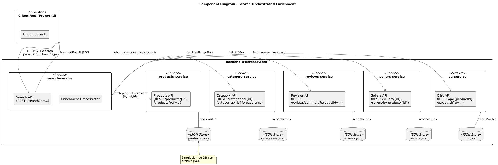
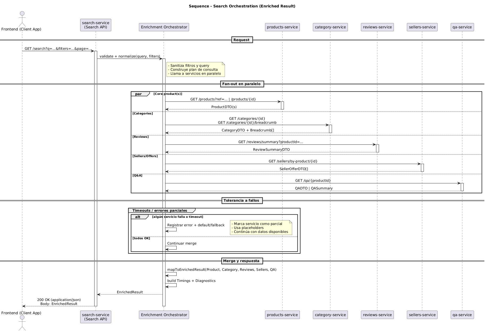

# Sistema Distribuido de Gestión de Inventario

## 1. Introducción

Este documento describe el diseño e implementación de un sistema distribuido de comunicación de productos para suministrar información pertinente al BE basado en los datos observados de ejemplo en la página de Mercadolibre.
El objetivo principal es optimizar la **entrega de la información de los productos**, reducir la **latencia la obtención de la información** y asegurar la **seguridad** y **observabilidad** del sistema.

Se realizó mediante una arquitectura de microservicios basada en **Java (Spring WebFlux)** para garantizar el flujo de datos asíncrono sin bloqueos.
La busqueda de datos en products-service implementó Fuzzy Search para mejorar la experiencia. 

Se puede visualizar la collection agregada a este archivo comprimido para ver todos los endpoints y probarlos directamente en Postman.

---

## 2. Arquitectura General del Sistema

El sistema se compone de los siguientes microservicios:

- **Category Service**: Administra las categorías disponibles para los productos, almancena categorías padre e hijos y hace el árbol completo de categorías si es solicitado.
- **Product Service**: Almacena la información de los productos, permite consultas por paginación usando filtros, permite autocompletar solo con el titulo de los productos, y obtener información de un producto en específico. Contiene Fuzzy search.
- **QA Service**: Administra las preguntas y respuestas relacionadas a los IDs de los productos.
- **Reviews Service**: Administra las reviews y calificaciones realizadas a cada ID de producto.
- **Seller Service**: Administra la información de los vendedores, sus IDs y popularidad, además de información extra visualizada en Mercadolibre como ejemplo.
- **Search Service**: Pensado como un BFF (backend for frontend) que centraliza la comunicación importante del cliente para consultar los otros servicios. Se comunica con todos los microservicios anteriormente mencionados para suministrar una información enriquecida de los productos.

## 3. Funcionamiento del Sistema

### 3.1 Obtención de datos enriquecidos

El search service se comunica con los otros microservicios para obtener la información necesaria para enriquecer los datos de los productos. El flujo general es el siguiente:

Así, tras una primera obtención de la información basica de cada producto, el Search Service realiza llamadas concurrentes a los otros microservicios para obtener el resto de información
útil para el cliente, complementando información de categorías, preguntas y respuestas, reviews y datos del vendedor. De esta forma, se entrega una respuesta completa y enriquecida al cliente con posibilidad de entregar diferentes elementos
e información relevante.

Se cumple el siguiente flujo:

### 3.2 Flujo de datos

1. Se obtiene la petición del cliente con los filtros necesarios y el ID solicitado, o el query en caso de buscar multiples productos.
2. Search Service consulta Product Service para obtener los productos base.
3. Product Service responde con los productos básicos.
4. Search Service realiza llamadas concurrentes a:
   - Category Service para obtener categorías.
   - QA Service para obtener preguntas y respuestas.
   - Reviews Service para obtener reviews y calificaciones.
   - Seller Service para obtener información del vendedor.
5. Cada servicio responde con la información solicitada.
6. Search Service compila toda la información y responde al cliente con datos enriquecidos.

---

## 4. Decisiones Arquitectónicas

| Elemento                       | Justificación                                                 |
| ------------------------------ | ------------------------------------------------------------- |
| **Microservicios**             | Separación de responsabilidades, escalabilidad independiente. |
| **WebFlux**                    | Asincronía eficiente y manejo reactivo.                       |
| **Retry en fachadas**          | Mayor tolerancia a fallos.                                    |
| **Excepciones personalizadas** | Mejor trazabilidad de errores.                                |
| **Pods redundantes**           | Alta disponibilidad        |

---

## 5. Requisitos No Funcionales Cumplidos

| Categoría               | Implementación                                                 |
| ----------------------- | -------------------------------------------------------------- |
| **Observabilidad**      | Excepciones con códigos personalizados y logging estructurado. |
| **Tolerancia a fallos** | Retry en llamadas entre microservicios.                        |
| **Escalabilidad**       | Servicios desacoplados y replicables.                          |
| **Documentación**       | Diagramas UML, README y estructura clara.                      |

---

## 6 Conclusión y Propuestas Futuras

El sistema planteado y desarrollado cumple con los requisitos funcionales y no funcionales establecidos inicialmente, proporcionando una solución robusta y escalable para la entrega de la información de productos, el uso de servicios desacoplados y la implementación de prácticas de desarrollo modernas permite una fácil evolución y mantenimiento del sistema.
La programación reactiva con Spring WebFlux asegura un manejo eficiente de las solicitudes concurrentes, optimizando el rendimiento y la capacidad de respuesta del sistema. El uso de excepciones personalizadas con códigos de error específicos mejora la trazabilidad y facilita la identificación de problemas durante la operación del sistema.
El manejo de errores permite que la entrega de información sea resiliente ante fallos temporales, garantizando una experiencia de usuario satisfactoria.

## Apoyo de Herramientas de Generación de Inteligencia Artificial (GenAI)

Durante el desarrollo del sistema distribuido, se utilizó activamente el apoyo de herramientas de Inteligencia Artificial Generativa como asistente técnico para acelerar la codificación y reducir errores en la construcción de capas del sistema.

En particular, se aprovecharon estas herramientas para:

- Generar rápidamente controladores REST bien documentados y estructurados. Ayudó mucho con javadoc y las anotaciones de Swagger.
- Crear los diagramas con el uso de PlantUML a partir de descripciones textuales.
- Escribir pruebas unitarias con mocking eficiente de dependencias.
- Documentar la arquitectura y explicar decisiones técnicas de forma clara y profesional.

Estas herramientas permitieron una mayor agilidad en el desarrollo, validación y documentación de los microservicios, así como una reducción significativa en el tiempo necesario para tareas repetitivas o estructurales dando una mayor productividad, coherencia en la arquitectura, y mejor trazabilidad del código, sin sacrificar el control humano sobre el diseño ni la calidad del sistema.
